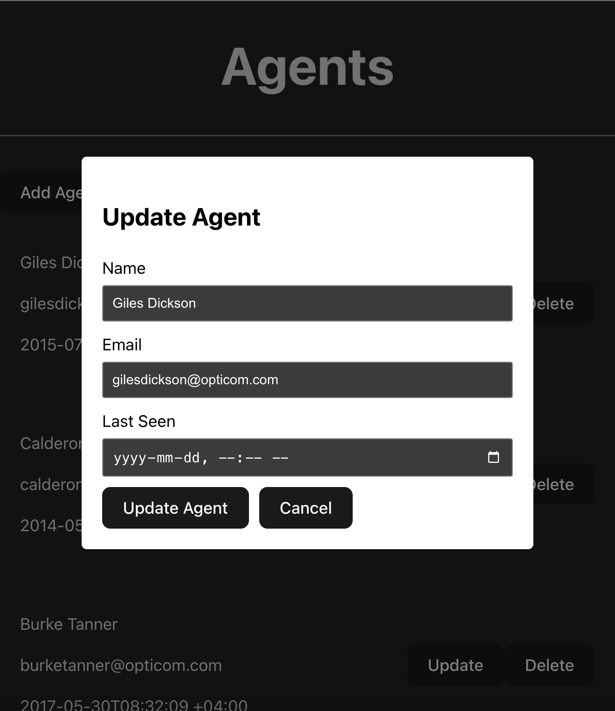

# Expresso Labs Home Assignment

This is the solution for the home assignment. Where you will see CRUD operations over a json file

## Installation

Install expressolabs with npm

```bash
  npm run install
  npm run dev
```

## Screenshots




## Video


